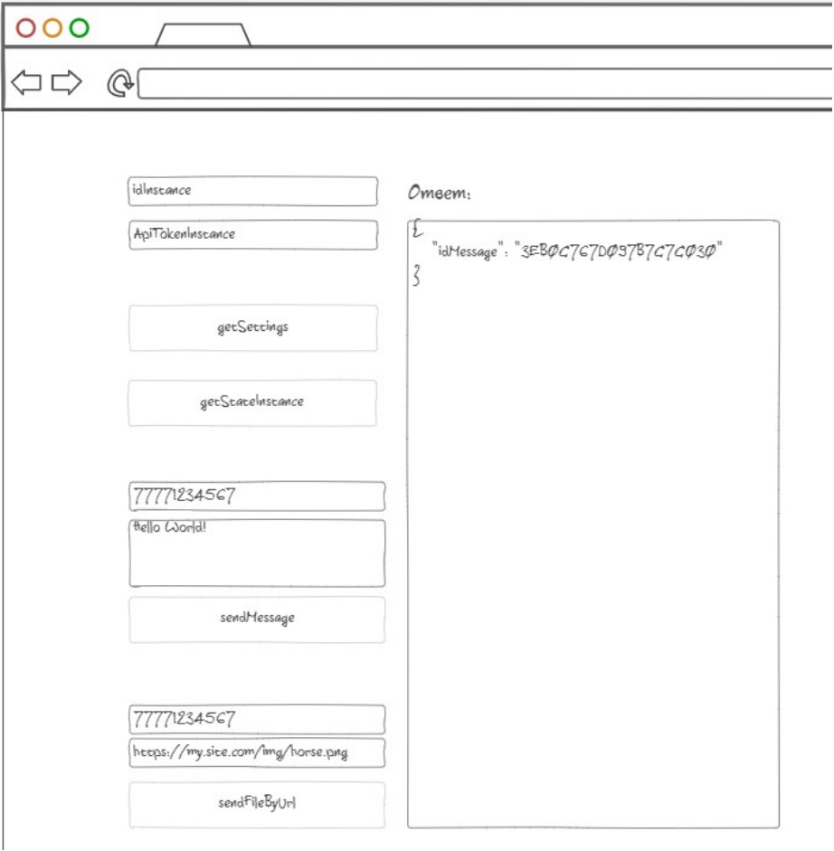

| | |
|:----------------------------:|:-----------------------:|
| | **Тестовое задание** |

В рамках выполнения тестового задания требуется разработать HTML-страницу
с методами [GREEN-API](https://green-api.com/) и опубликовать исходники проекта на Github и
HTML-страницу страницу в Интернете, для дальнейшей проверки, а также снять
короткое видео. Это повысит шансы на успех.

Время на выполнения задания: 3 дня. 

### Требования
1. Требуется разработать HTML-страницу с вызовами методов GREEN-API:
    - [getSettings](https://green-api.com/docs/api/account/GetSettings/)
    - [getStateInstance](https://green-api.com/docs/api/account/GetStateInstance/)
    - [sendMessage](https://green-api.com/docs/api/sending/SendMessage/)
    - [sendFileByUrl](https://green-api.com/docs/api/sending/SendFileByUrl/)
2. Требуется разместить на странице параметры [подключения к инстансу - idInstance и ApiTokenInstance](https://green-api.com/docs/before-start/#parameters)
3. Требуется вывести ответ методов в отдельное поле на странице только для чтения.
4. Требуется придерживаться макета – см. рис. ниже.

### Макет

